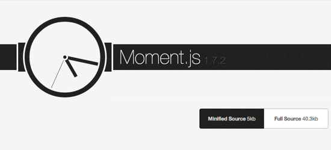
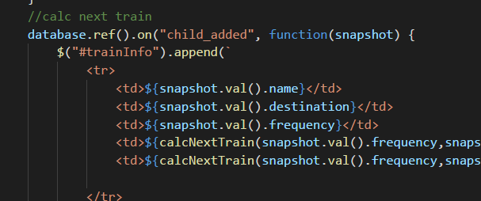

# Train Scheduler

In this assignment I created a train scheduling application that incorporates Firebase to host arrival and deparature data.&nbsp; This app retrieves and manipulates this information with Moment.js.&nbsp; This website will provide up-to-date information about various trains, namely their arrival times and how many minutes remain until they arrive at their destination.
 
 

 In my HTML page I created a table to house all the rows and columns. &nbsp;The table is broken up into different sections like table head, and table body.&nbsp; The table uses jQuery to link to the javascript file with the id 'traininfo':   

I use the database variable (which is defined as firebase) and append the traininfo there.&nbsp; This helps us calculate the next train time.

 
